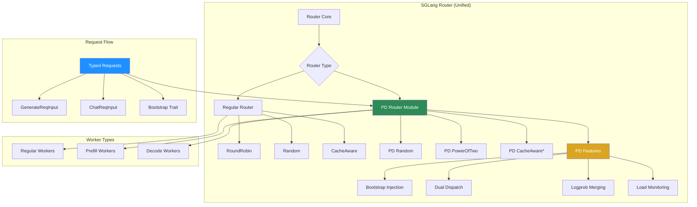
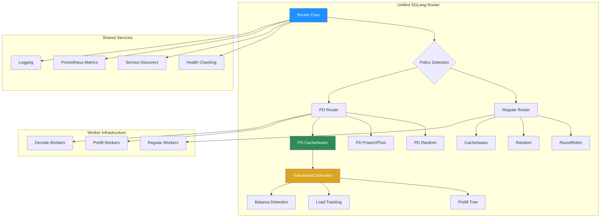
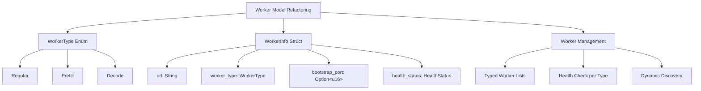
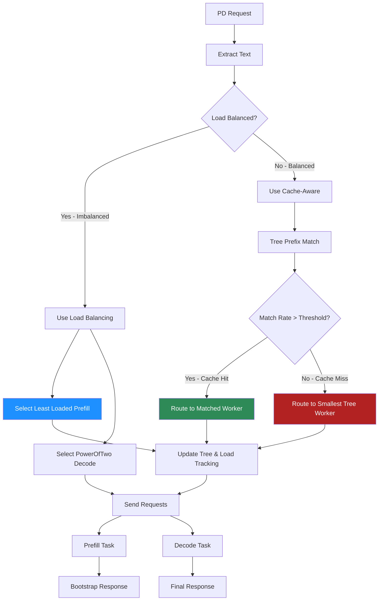
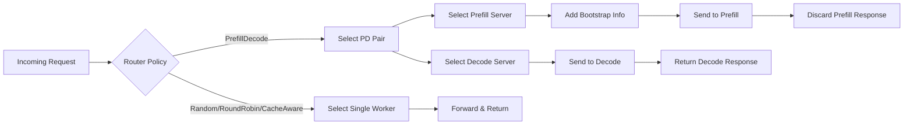
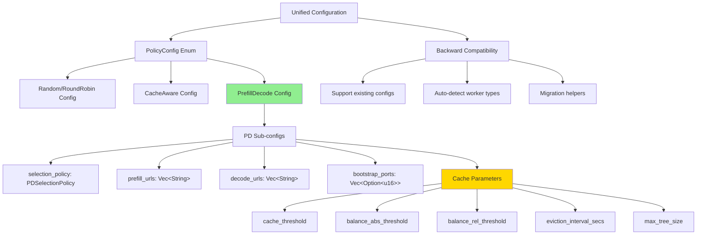

# Design Document: Merging PDLB into SGLang Router

**Status: Phase 1 & 2 Complete** ✅

## Overview

This document outlines the design and implementation for merging the Prefill-Decode Load Balancer (PDLB) functionality into the existing SGLang Router. The goal is to create a unified routing solution that supports both traditional load balancing and prefill-decode disaggregated routing.

**Update**: Phases 1 and 2 have been successfully implemented with a clean modular architecture that separates PD-specific logic into dedicated modules while preserving the existing router functionality.

## Current State

### SGLang Router
- **Purpose**: Generic load balancer for OpenAI-compatible servers
- **Features**:
  - Multiple routing policies (Random, RoundRobin, CacheAware)
  - Service discovery integration
  - Prometheus metrics
  - Health checking and automatic failover
  - Tree-based cache-aware routing
  - Structured logging

### PDLB (Prefill-Decode Load Balancer)
- **Purpose**: Specialized load balancer for prefill-decode disaggregated systems
- **Features**:
  - Routes each request to both a prefill and decode server
  - Bootstrap information injection
  - PowerOfTwo selection algorithm
  - Load tracking per server type

## Key Design Decisions (Clean Build Approach)

Since PDLB has no existing users, we can make optimal design choices:

1. **Extend Router, Don't Replace**: Add PD as new Router capability, preserve existing functionality
2. **Cherry-Pick from PDLB**: Copy only essential components (Bootstrap, EngineInfo), discard the rest
3. **Clean API Design**: Provide dedicated PD constructor instead of overloading existing one
4. **No Migration Burden**: Build optimal solution without compatibility constraints
5. **Cache-Aware First**: Implement cache-aware PD routing as primary feature, not afterthought

## Design Philosophy

The core idea is to integrate PDLB as a new routing policy within the existing router framework, treating prefill-decode disaggregation as a specialized load balancing strategy. However, after detailed code analysis, this integration is more complex than initially anticipated due to fundamental architectural differences.

**Key Challenges Identified:**
- **Request Handling**: PDLB uses typed structs with Bootstrap trait, Router uses raw Bytes
- **Worker Management**: PDLB separates prefill/decode workers, Router treats all workers uniformly
- **Selection Logic**: PDLB selects pairs `(prefill, decode)`, Router selects single workers
- **Bootstrap Mechanism**: PDLB has sophisticated batch/single request handling with bootstrap injection

This approach:
- Preserves the router's architecture but requires significant extensions
- Reuses existing infrastructure (health checking, metrics, service discovery)
- Maintains backward compatibility with careful API design
- Enables feature sharing between routing modes with architectural bridging

## Critical Architecture Differences

### 1. Python Binding Structure

**Current PDLB:**
```python
# sgl-pdlb module: "_rust"
LoadBalancer(
    host="localhost", port=8080, policy="po2",
    prefill_infos=[("http://p1:8080", 9000)],
    decode_infos=["http://d1:8080"],
    log_interval=5, timeout=600
)
```

**Current Router:**
```python
# sgl-router module: "sglang_router_rs"
Router(
    worker_urls=["http://w1:8080", "http://w2:8080"],
    policy=PolicyType.CacheAware,
    cache_threshold=0.5,
    # + 15 other parameters
)
```

**Integration Challenge**: Completely different parameter structures and module names.

### 2. Request Processing Pipeline

**PDLB Flow:**
```rust
// Typed request parsing
web::Json<GenerateReqInput> -> Box<dyn Bootstrap>
-> add_bootstrap_info() -> serde_json::Value
-> route to BOTH prefill AND decode
```

**Router Flow:**
```rust
// Raw byte processing
Bytes -> get_text_from_request() -> select_generate_worker()
-> route to SINGLE worker
```

**Integration Challenge**: Fundamental difference in request handling paradigm.

### 3. Worker Selection Logic

**PDLB Selection:**
```rust
// Returns (prefill_server, decode_server)
pub async fn select_pair(&self, client: &reqwest::Client) -> (EngineInfo, EngineInfo)
```

**Router Selection:**
```rust
// Returns single worker URL
fn select_generate_worker(&self, body: &Bytes, route: &str) -> String
```

**Integration Challenge**: PD routing requires selecting PAIRS, not single workers.

### 4. Bootstrap Injection Mechanism

**PDLB Bootstrap (Core Feature):**
```rust
trait Bootstrap {
    fn add_bootstrap_info(&mut self, prefill_info: &EngineInfo) -> Result<(), Error>;
    fn get_batch_size(&self) -> Result<Option<usize>, Error>;
    // Handles SingleOrBatch<T> for both single and batch requests
}
```

**Router**: No equivalent - sends requests directly without modification.

**Integration Challenge**: Bootstrap injection is fundamental to PD disaggregation.

## Actual Implementation (Phases 1 & 2 Complete)

### Implemented Architecture



*Note: Cache-aware PD selection is designed but not yet implemented (Phase 3).

### Module Structure

1. **pd_types.rs**: Core PD types extracted from PDLB
   - `EngineInfo`: Worker information with bootstrap ports
   - `PDSelectionPolicy`: Random, PowerOfTwo, CacheAware
   - `Bootstrap` trait: For request modification
   - `GenerateReqInput`/`ChatReqInput`: Typed request structs
   - `SingleOrBatch<T>`: Handles both single and batch requests

2. **pd_router.rs**: PD-specific routing logic
   - `PDRouter`: Manages prefill/decode workers
   - Dual dispatch implementation
   - Logprob merging (streaming & non-streaming)
   - Background load monitoring
   - PD-specific endpoints

3. **router.rs**: Extended with PrefillDecode variant
   - Clean separation of regular vs PD routing
   - Delegates PD operations to PDRouter
   - Preserves existing functionality

4. **server.rs**: Updated request handling
   - Typed request parsing for PD mode
   - PD-specific endpoint routing
   - Increased payload size support (256MB)

## Implementation Plan

### System Architecture Overview



### Phase 1: Extend Worker Model

#### 1.1 Worker Model Architecture



#### 1.2 Worker Type System

**Current Router Worker Storage:**
```rust
// router.rs - Current implementation
pub enum Router {
    CacheAware {
        worker_urls: Arc<RwLock<Vec<String>>>,  // Simple URL list
        // ...
    }
}
```

**Current PDLB Worker Storage:**
```rust
// strategy_lb.rs - Current implementation
pub struct StrategyLB {
    pub prefill_servers: Vec<EngineInfo>,     // Separate typed lists
    pub decode_servers: Vec<EngineInfo>,
}

pub struct EngineInfo {
    pub engine_type: EngineType,
    pub url: String,
    pub bootstrap_port: Option<u16>,         // Critical for PD routing
}
```

**Integration Approach - Extend Router Enum:**
```rust
// REVISED: Add PrefillDecode variant to existing Router enum
pub enum Router {
    RoundRobin { /* existing */ },
    Random { /* existing */ },
    CacheAware { /* existing */ },
    PrefillDecode {
        prefill_workers: Arc<RwLock<Vec<EngineInfo>>>,    // Reuse PDLB types
        decode_workers: Arc<RwLock<Vec<EngineInfo>>>,
        selection_policy: PDSelectionPolicy,
        load_tracking: Arc<Mutex<HashMap<String, usize>>>,
        // Inherit cache-aware components for PD mode
        prefill_tree: Option<Arc<Mutex<Tree>>>,
        timeout_secs: u64,
        interval_secs: u64,
    },
}
```

**Key Changes:**
- **DO NOT** replace existing Router worker storage - extend it
- Add new `PrefillDecode` Router variant alongside existing ones
- Reuse PDLB's `EngineInfo` structure as-is
- Support both regular routing and PD routing in same codebase

### Phase 2: Add PrefillDecode Routing Policy

#### 2.1 Router Extension

```rust
// In router.rs
#[derive(Debug)]
pub enum Router {
    RoundRobin { /* existing */ },
    Random { /* existing */ },
    CacheAware { /* existing */ },
    PrefillDecode {
        worker_pool: Arc<WorkerPool>,
        selection_policy: PDSelectionPolicy,
        load_tracking: Arc<Mutex<HashMap<String, usize>>>,
        processed_tracking: Arc<Mutex<HashMap<String, usize>>>,
        timeout_secs: u64,
        interval_secs: u64,
    },
}

#[derive(Debug, Clone)]
pub enum PDSelectionPolicy {
    Random,
    PowerOfTwo,
    CacheAware {
        tree: Arc<Mutex<Tree>>,
        cache_threshold: f32,
        balance_abs_threshold: usize,
        balance_rel_threshold: f32,
    },
}
```

#### 2.2 Bootstrap Mechanism

```rust
// In a new module: bootstrap.rs
use serde::{Deserialize, Serialize};

#[derive(Debug, Deserialize, Serialize)]
#[serde(untagged)]
pub enum SingleOrBatch<T> {
    Single(T),
    Batch(Vec<T>),
}

pub trait BootstrapInjector {
    fn inject_bootstrap_info(
        &mut self,
        prefill_info: &WorkerInfo,
        decode_room: u64,
    ) -> Result<(), String>;
}

impl BootstrapInjector for serde_json::Value {
    fn inject_bootstrap_info(
        &mut self,
        prefill_info: &WorkerInfo,
        decode_room: u64,
    ) -> Result<(), String> {
        // Implementation to inject bootstrap_host, bootstrap_port, bootstrap_room
        // Handle both single and batch requests
        let batch_size = self.get_batch_size()?;

        if let Some(batch_size) = batch_size {
            // Batch request
            self["bootstrap_host"] = json!(vec![prefill_info.get_hostname(); batch_size]);
            self["bootstrap_port"] = json!(vec![prefill_info.bootstrap_port; batch_size]);
            self["bootstrap_room"] = json!((0..batch_size).map(|_| rand::random::<u64>()).collect::<Vec<_>>());
        } else {
            // Single request
            self["bootstrap_host"] = json!(prefill_info.get_hostname());
            self["bootstrap_port"] = json!(prefill_info.bootstrap_port);
            self["bootstrap_room"] = json!(decode_room);
        }

        Ok(())
    }
}
```

### Phase 3: Selection Algorithms

#### 3.1 PowerOfTwo Implementation

```rust
// In router.rs, within PrefillDecode implementation
impl Router {
    async fn select_pd_pair_power_of_two(
        &self,
        client: &reqwest::Client,
    ) -> (WorkerInfo, WorkerInfo) {
        let mut rng = rand::thread_rng();

        // Select two random prefill servers
        let prefill1 = self.select_random_worker(WorkerType::Prefill);
        let prefill2 = self.select_random_worker(WorkerType::Prefill);

        // Select two random decode servers
        let decode1 = self.select_random_worker(WorkerType::Decode);
        let decode2 = self.select_random_worker(WorkerType::Decode);

        // Get loads asynchronously
        let (p1_load, p2_load, d1_load, d2_load) = tokio::join!(
            self.get_worker_load(client, &prefill1),
            self.get_worker_load(client, &prefill2),
            self.get_worker_load(client, &decode1),
            self.get_worker_load(client, &decode2),
        );

        // Select workers with lower load
        let selected_prefill = if p1_load <= p2_load { prefill1 } else { prefill2 };
        let selected_decode = if d1_load <= d2_load { decode1 } else { decode2 };

        (selected_prefill, selected_decode)
    }
}
```

#### 3.2 Cache-Aware PD Selection

**Feasibility Analysis**: After careful evaluation of both codebases, implementing cache-aware load balancing for PDLB is **highly feasible and beneficial**:

1. **Request Compatibility**: Router's `get_text_from_request()` already handles the same formats PDLB uses (`/generate`, `/v1/chat/completions`)
2. **Tree Architecture**: The multi-tenant radix tree can be adapted for PD routing
3. **Performance Benefits**: Cache-aware prefill selection significantly improves cache hit rates

**Cache-Aware PD Selection Flow**:



**Implementation Strategy**:

```rust
// Extended WorkerPool with cache-aware components
pub struct WorkerPool {
    regular_workers: Arc<RwLock<Vec<WorkerInfo>>>,
    prefill_workers: Arc<RwLock<Vec<WorkerInfo>>>,
    decode_workers: Arc<RwLock<Vec<WorkerInfo>>>,

    // Cache-aware components for PD mode
    prefill_tree: Option<Arc<Mutex<Tree>>>,
    prefill_load_tracking: Option<Arc<Mutex<HashMap<String, usize>>>>,
}

// Text extraction for PD requests
fn extract_text_from_pd_request(json: &serde_json::Value, api_path: &str) -> String {
    match api_path {
        "/generate" => {
            // Handle both single and batch requests
            if let Some(text) = json.get("text") {
                if text.is_string() {
                    text.as_str().unwrap_or("").to_string()
                } else if text.is_array() {
                    // For batch requests, use first text
                    text.as_array().and_then(|arr| arr.first())
                        .and_then(|v| v.as_str())
                        .unwrap_or("").to_string()
                } else { String::new() }
            } else { String::new() }
        }
        "/v1/chat/completions" => {
            if let Some(messages) = json.get("messages") {
                serde_json::to_string(messages).unwrap_or_default()
            } else if let Some(prompt) = json.get("prompt").and_then(|p| p.as_str()) {
                prompt.to_string()
            } else { String::new() }
        }
        _ => String::new(),
    }
}

// Cache-aware PD pair selection
impl Router {
    async fn select_pd_pair_cache_aware(
        &self,
        client: &reqwest::Client,
        text: &str,
    ) -> (WorkerInfo, WorkerInfo) {
        if let Router::PrefillDecode {
            worker_pool,
            selection_policy: PDSelectionPolicy::CacheAware {
                tree,
                cache_threshold,
                balance_abs_threshold,
                balance_rel_threshold,
            },
            load_tracking,
            ..
        } = self {

            // 1. Cache-aware PREFILL selection
            let tree = tree.lock().unwrap();
            let load_tracking = load_tracking.lock().unwrap();

            // Check load imbalance (same logic as router CacheAware)
            let max_load = *load_tracking.values().max().unwrap_or(&0);
            let min_load = *load_tracking.values().min().unwrap_or(&0);
            let is_imbalanced = max_load.saturating_sub(min_load) > *balance_abs_threshold
                && (max_load as f32) > (min_load as f32 * balance_rel_threshold);

            let selected_prefill = if is_imbalanced {
                // Use load balancing when imbalanced
                let least_loaded_url = load_tracking.iter()
                    .min_by_key(|(_, &count)| count)
                    .map(|(url, _)| url.clone())
                    .unwrap();

                worker_pool.prefill_workers.read().unwrap().iter()
                    .find(|w| w.url == least_loaded_url)
                    .cloned()
                    .unwrap()
            } else {
                // Use cache-aware routing when balanced
                let (matched_text, matched_worker) = tree.prefix_match(text);
                let match_rate = matched_text.chars().count() as f32 / text.chars().count() as f32;

                if match_rate > *cache_threshold {
                    // High cache hit - use matched worker
                    worker_pool.prefill_workers.read().unwrap().iter()
                        .find(|w| w.url == matched_worker)
                        .cloned()
                        .unwrap()
                } else {
                    // Low cache hit - use worker with most available cache space
                    let smallest_tenant = tree.get_smallest_tenant();
                    worker_pool.prefill_workers.read().unwrap().iter()
                        .find(|w| w.url == smallest_tenant)
                        .cloned()
                        .unwrap()
                }
            };

            // 2. For DECODE, use PowerOfTwo selection
            let decode = self.select_decode_worker_po2(client).await;

            // 3. Update tree and load tracking
            tree.insert(text, &selected_prefill.url);
            *load_tracking.get_mut(&selected_prefill.url).unwrap() += 1;

            // 4. Record metrics
            if match_rate > *cache_threshold {
                counter!("sgl_router_pd_cache_hits_total").increment(1);
            } else {
                counter!("sgl_router_pd_cache_misses_total").increment(1);
            }

            (selected_prefill, decode)
        } else {
            // Fallback to other selection methods
            self.select_pd_pair_power_of_two(client).await
        }
    }
}
```

#### 3.3 Request Routing Flow



```rust
// In router.rs
impl Router {
    pub async fn route_generate_request(
        &self,
        client: &reqwest::Client,
        req: &HttpRequest,
        body: &Bytes,
        route: &str,
    ) -> HttpResponse {
        match self {
            Router::PrefillDecode { .. } => {
                self.route_pd_request(client, req, body, route).await
            }
            _ => {
                // Existing single-worker routing logic
                self.route_single_worker_request(client, req, body, route).await
            }
        }
    }

**CRITICAL ISSUE**: This approach oversimplifies the bootstrap injection complexity.

**Current PDLB Bootstrap Flow (from actual code):**
```rust
// PDLB uses typed request structs with Bootstrap trait
pub async fn generate(
    &self,
    api_path: &str,
    mut req: Box<dyn Bootstrap>,              // Typed struct with Bootstrap trait
) -> Result<HttpResponse, actix_web::Error> {
    let (prefill, decode) = self.strategy_lb.select_pair(&self.client).await;
    let stream = req.is_stream();
    req.add_bootstrap_info(&prefill)?;        // Bootstrap injection via trait method
    let json = serde_json::to_value(req)?;    // Convert to JSON AFTER injection

    // Send to BOTH servers concurrently
    let prefill_task = self.route_one(&prefill, Method::POST, api_path, Some(&json), false);
    let decode_task = self.route_one(&decode, Method::POST, api_path, Some(&json), stream);
    let (_, decode_response) = tokio::join!(prefill_task, decode_task);
    decode_response?.into()
}
```

**Router's Current Flow (from actual code):**
```rust
// Router uses raw bytes - completely different paradigm
pub async fn route_generate_request(
    &self,
    client: &reqwest::Client,
    req: &HttpRequest,
    body: &Bytes,                            // Raw bytes, not typed structs
    route: &str,
) -> HttpResponse {
    let worker_url = self.select_generate_worker(body, route);  // Single worker
    self.send_generate_request(client, req, body, route, &worker_url).await
}
```

**REVISED PD Integration Approach:**

```rust
// New PD routing method in Router enum
impl Router {
    pub async fn route_generate_request(
        &self,
        client: &reqwest::Client,
        req: &HttpRequest,
        body: &Bytes,
        route: &str,
    ) -> HttpResponse {
        match self {
            Router::PrefillDecode { .. } => {
                self.route_pd_request(client, req, body, route).await
            }
            _ => {
                // Existing single-worker routing logic (unchanged)
                let worker_url = self.select_generate_worker(body, route);
                self.send_generate_request(client, req, body, route, &worker_url).await
            }
        }
    }

    async fn route_pd_request(
        &self,
        client: &reqwest::Client,
        req: &HttpRequest,
        body: &Bytes,
        route: &str,
    ) -> HttpResponse {
        // 1. Parse raw bytes into PDLB-compatible request struct
        let mut typed_request: Box<dyn Bootstrap> = match route {
            "/generate" => {
                let gen_req: GenerateReqInput = serde_json::from_slice(body)
                    .map_err(|_| HttpResponse::BadRequest().body("Invalid JSON"))?;
                Box::new(gen_req)
            }
            "/v1/chat/completions" => {
                let chat_req: ChatReqInput = serde_json::from_slice(body)
                    .map_err(|_| HttpResponse::BadRequest().body("Invalid JSON"))?;
                Box::new(chat_req)
            }
            _ => return HttpResponse::BadRequest().body("Unsupported route for PD")
        };

        // 2. Extract text for cache-aware routing (if enabled)
        let text = if let PDSelectionPolicy::CacheAware { .. } = self.selection_policy {
            extract_text_from_typed_request(&*typed_request, route)
        } else {
            String::new()
        };

        // 3. Select prefill and decode servers
        let (prefill, decode) = match &self.selection_policy {
            PDSelectionPolicy::CacheAware { .. } if !text.is_empty() => {
                self.select_pd_pair_cache_aware(client, &text).await
            }
            PDSelectionPolicy::PowerOfTwo => {
                self.select_pd_pair_power_of_two(client).await
            }
            PDSelectionPolicy::Random => {
                self.select_pd_pair_random()
            }
        };

        // 4. **CRITICAL**: Bootstrap injection using PDLB's trait system
        if let Err(e) = typed_request.add_bootstrap_info(&prefill) {
            return HttpResponse::InternalServerError().body(format!("Bootstrap injection failed: {}", e));
        }

        // 5. Convert back to JSON after bootstrap injection
        let json_with_bootstrap = match serde_json::to_value(&*typed_request) {
            Ok(json) => json,
            Err(e) => return HttpResponse::InternalServerError().body(format!("JSON serialization failed: {}", e))
        };

        // 6. Send to BOTH prefill and decode servers (core PD logic)
        let is_stream = typed_request.is_stream();
        let prefill_task = self.send_pd_request(client, &prefill, route, &json_with_bootstrap, false);
        let decode_task = self.send_pd_request(client, &decode, route, &json_with_bootstrap, is_stream);

        // 7. Wait for both, return only decode response (PD paradigm)
        let (_, decode_response) = tokio::join!(prefill_task, decode_task);
        decode_response.unwrap_or_else(|_| HttpResponse::InternalServerError().finish())
    }
}
```

**Key Implementation Challenges:**
1. **Type Conversion**: Router's `Bytes` → PDLB's `Box<dyn Bootstrap>` → JSON
2. **Bootstrap Injection**: Must use PDLB's trait system for batch/single request handling
3. **Dual Dispatch**: Send to BOTH servers, return only decode response
4. **Error Handling**: Handle bootstrap injection failures gracefully


### Phase 4: Configuration Structure

#### 4.1 Configuration Architecture



#### 4.2 Unified PolicyConfig

```rust
// In router.rs
#[derive(Debug, Clone)]
pub enum PolicyConfig {
    RandomConfig { /* existing */ },
    RoundRobinConfig { /* existing */ },
    CacheAwareConfig { /* existing */ },
    PrefillDecodeConfig {
        selection_policy: PDSelectionPolicy,
        prefill_urls: Vec<(String, Option<u16>)>, // (url, bootstrap_port)
        decode_urls: Vec<String>,
        timeout_secs: u64,
        interval_secs: u64,
        log_interval: u64,
        // Cache-aware configuration
        cache_threshold: Option<f32>,
        balance_abs_threshold: Option<usize>,
        balance_rel_threshold: Option<f32>,
        eviction_interval_secs: Option<u64>,
        max_tree_size: Option<usize>,
    },
}
```

#### 4.2 Python Bindings

```rust
// In lib.rs
**CRITICAL ISSUE**: This approach won't work due to current Router constructor limitations.

**Current Router Constructor (from actual code):**
```rust
#[pymethods]
impl Router {
    #[new]
    fn new(
        worker_urls: Vec<String>,          // Required, not Optional!
        policy: PolicyType,                // Only Random/RoundRobin/CacheAware
        host: String,
        port: u16,
        // ... 15+ other required parameters
    ) -> PyResult<Self>
}
```

**REVISED APPROACH - Two-Phase Migration:**

**Phase A: Extend Router to Support PD Mode**
```rust
#[pyclass(eq)]
#[derive(Clone, PartialEq, Debug)]
pub enum PolicyType {
    Random,
    RoundRobin,
    CacheAware,
    PrefillDecode,              // Add PD policy type
}

// OPTION 1: Extend existing Router constructor (Breaking Change)
#[pymethods]
impl Router {
    #[new]
    #[pyo3(signature = (
        // Keep existing required params for backward compatibility
        worker_urls,
        policy = PolicyType::RoundRobin,
        // ... existing params ...

        // Add new optional PD params
        prefill_urls = None,
        decode_urls = None,
    ))]
    fn new(
        worker_urls: Vec<String>,                           // Required for regular mode
        policy: PolicyType,
        // ... existing params ...
        prefill_urls: Option<Vec<(String, Option<u16>)>>,  // Optional for PD mode
        decode_urls: Option<Vec<String>>,                   // Optional for PD mode
    ) -> PyResult<Self> {

        let policy_config = match policy {
            PolicyType::PrefillDecode => {
                if prefill_urls.is_none() || decode_urls.is_none() {
                    return Err(PyErr::new::<pyo3::exceptions::PyValueError, _>(
                        "PrefillDecode policy requires both prefill_urls and decode_urls"
                    ));
                }
                PolicyConfig::PrefillDecodeConfig {
                    prefill_urls: prefill_urls.unwrap(),
                    decode_urls: decode_urls.unwrap(),
                    // ... other config
                }
            }
            _ => {
                // Existing regular router policies
                // Use worker_urls for backward compatibility
            }
        };
    }
}
```

**OPTION 2: Separate PD Constructor (Non-Breaking)**
```rust
#[pymethods]
impl Router {
    // Keep existing constructor unchanged
    #[new]
    fn new(/* existing params */) -> PyResult<Self> { /* existing code */ }

    // Add new PD-specific constructor
    #[classmethod]
    fn new_prefill_decode(
        _cls: &PyType,
        prefill_urls: Vec<(String, Option<u16>)>,
        decode_urls: Vec<String>,
        policy: String,                    // "random", "po2", "cache_aware"
        host: String,
        port: u16,
        // ... other PD-specific params
    ) -> PyResult<Self> {
        // Create PrefillDecode router variant
    }
}
```

**Phase B: Migration Path**
```python
# Current Router usage (unchanged)
router = Router(
    worker_urls=["http://w1:8080", "http://w2:8080"],
    policy=PolicyType.CacheAware
)

# New PD usage - Option 1 (Breaking)
router = Router(
    worker_urls=[],  # Empty for PD mode
    policy=PolicyType.PrefillDecode,
    prefill_urls=[("http://p1:8080", 9000)],
    decode_urls=["http://d1:8080"]
)

# New PD usage - Option 2 (Non-Breaking)
router = Router.new_prefill_decode(
    prefill_urls=[("http://p1:8080", 9000)],
    decode_urls=["http://d1:8080"],
    policy="cache_aware"
)
```
```

### Phase 5: Feature Integration

#### 5.1 Metrics Extension

```rust
// Extend existing metrics for PD mode
impl Router {
    fn record_pd_metrics(&self, route: &str, prefill_url: &str, decode_url: &str) {
        counter!("sgl_router_requests_total",
            "route" => route.to_string(),
            "mode" => "prefill_decode"
        ).increment(1);

        counter!("sgl_router_pd_prefill_requests_total",
            "worker" => prefill_url.to_string()
        ).increment(1);

        counter!("sgl_router_pd_decode_requests_total",
            "worker" => decode_url.to_string()
        ).increment(1);
    }

    fn record_pd_load_metrics(&self, prefill_load: usize, decode_load: usize) {
        gauge!("sgl_router_pd_prefill_max_load").set(prefill_load as f64);
        gauge!("sgl_router_pd_decode_max_load").set(decode_load as f64);
    }

    // Cache-aware specific metrics
    fn record_pd_cache_metrics(&self, cache_hit: bool, match_rate: f32, selection_policy: &str) {
        if cache_hit {
            counter!("sgl_router_pd_cache_hits_total").increment(1);
        } else {
            counter!("sgl_router_pd_cache_misses_total").increment(1);
        }

        histogram!("sgl_router_pd_cache_match_rate").record(match_rate as f64);

        counter!("sgl_router_pd_selection_events_total",
            "policy" => selection_policy.to_string()
        ).increment(1);

        // Tree size metrics for monitoring memory usage
        gauge!("sgl_router_pd_tree_total_nodes").set(self.get_tree_node_count() as f64);
        gauge!("sgl_router_pd_tree_memory_usage_chars").set(self.get_tree_char_count() as f64);
    }
}

// Additional metrics for monitoring PD performance
static PD_CACHE_HIT_RATE: LazyLock<Family<Labels, Histogram>> = LazyLock::new(|| {
    let opts = HistogramOpts::new("sgl_router_pd_cache_hit_rate", "Cache hit rate for PD routing")
        .buckets(vec![0.0, 0.1, 0.2, 0.3, 0.4, 0.5, 0.6, 0.7, 0.8, 0.9, 1.0]);
    register_histogram_vec!(opts, &["worker_type"]).unwrap()
});

static PD_SELECTION_LATENCY: LazyLock<Family<Labels, Histogram>> = LazyLock::new(|| {
    let opts = HistogramOpts::new("sgl_router_pd_selection_duration_seconds",
        "Time spent selecting PD worker pair")
        .buckets(prometheus::DEFAULT_BUCKETS.to_vec());
    register_histogram_vec!(opts, &["policy"]).unwrap()
});
```

#### 5.2 Service Discovery Support

```rust
// Extend service discovery for typed workers
#[derive(Debug, Clone)]
pub struct ServiceDiscoveryConfig {
    pub enabled: bool,
    pub selector: HashMap<String, String>,
    pub worker_type_label: String,  // e.g., "sglang.worker.type"
    pub prefill_selector: Option<HashMap<String, String>>,
    pub decode_selector: Option<HashMap<String, String>>,
    // ... existing fields
}

impl ServiceDiscoveryConfig {
    pub fn detect_worker_type(&self, pod: &Pod) -> WorkerType {
        if let Some(labels) = &pod.metadata.labels {
            match labels.get(&self.worker_type_label).map(|s| s.as_str()) {
                Some("prefill") => WorkerType::Prefill,
                Some("decode") => WorkerType::Decode,
                _ => WorkerType::Regular,
            }
        } else {
            WorkerType::Regular
        }
    }
}
```

### Phase 6: Clean Implementation (No Migration Needed!)

Since there are no PDLB users, we can implement the ideal solution directly:

#### 6.1 Simplified Python API

```python
# Direct PD support in Router
from sglang_router import Router, PolicyType

# Option 1: Extend existing Router constructor
router = Router(
    worker_urls=[],  # Empty for PD mode (or make optional)
    policy=PolicyType.PrefillDecode,
    prefill_urls=[
        ("http://prefill1:8080", 9000),
        ("http://prefill2:8080", 9001),
    ],
    decode_urls=[
        "http://decode1:8080",
        "http://decode2:8080",
    ],
    pd_policy="cache_aware",  # or "random", "po2"
    cache_threshold=0.6,
    # ... other params
)

# Option 2: Dedicated PD constructor (cleaner)
router = Router.new_pd(
    prefill_urls=[("http://p1:8080", 9000), ("http://p2:8080", 9001)],
    decode_urls=["http://d1:8080", "http://d2:8080"],
    policy="cache_aware",
    cache_threshold=0.6,
    host="localhost",
    port=8080
)
```

#### 6.2 Internal Implementation

```rust
// Copy only what we need from PDLB
mod pd_types {
    pub use sgl_pdlb::io_struct::{Bootstrap, SingleOrBatch};
    pub use sgl_pdlb::strategy_lb::EngineInfo;
    // Don't copy the entire PDLB - just essentials
}

// Extend Router directly
impl Router {
    // No compatibility layers needed!
    // Build the optimal solution from scratch
}
```

## Testing Strategy

### Unit Tests
1. **Worker Management**: Test typed worker storage and operations
2. **Bootstrap Injection**: Test single/batch bootstrap info injection
3. **Selection Algorithms**: Test PowerOfTwo and cache-aware PD selection methods
4. **Configuration**: Test config parsing and validation
5. **Text Extraction**: Test text extraction from various request formats
6. **Tree Operations**: Test tree insertion, matching, and eviction in PD context

### Integration Tests
1. **End-to-End PD Routing**: Test full request flow through PD mode
2. **Failover**: Test behavior when prefill/decode servers fail
3. **Load Balancing**: Verify load distribution across server types
4. **Stream Handling**: Test streaming responses in PD mode
5. **Cache-Aware Routing**: Test cache hit/miss scenarios
6. **Policy Switching**: Test dynamic switching between cache-aware and load-based routing

### Performance Tests
1. **Latency**: Ensure PD routing doesn't add significant overhead
2. **Throughput**: Test concurrent request handling
3. **Resource Usage**: Monitor memory and CPU usage
4. **Cache Performance**: Measure cache hit rates and latency improvements
5. **Tree Memory Usage**: Monitor tree growth and eviction effectiveness
6. **Selection Performance**: Benchmark different selection algorithms

### Cache-Aware Specific Tests
1. **Pattern Recognition**: Test tree's ability to identify similar requests
2. **Load Balancing Fallback**: Verify fallback when system is imbalanced
3. **Batch Request Handling**: Test cache locality for batch requests
4. **Memory Management**: Test tree eviction under memory pressure
5. **Concurrent Access**: Test tree thread safety under high load
6. **Metrics Accuracy**: Validate cache hit rate and selection metrics

### Compatibility Tests
1. **Existing Router Clients**: Ensure no breaking changes to regular Router usage
2. **Configuration**: Test various configuration scenarios
3. **API Validation**: Test both constructor options for PD mode
4. **Error Handling**: Test graceful handling of invalid PD configurations

## Implementation Timeline

**With no PDLB migration concerns, we can deliver much faster:**

| Week | Phase | Description | Complexity |
|------|-------|-------------|------------|
| 1-2  | Phase 1A | Extract PDLB Components | **LOW** - Copy essential code only |
| 3-4  | Phase 1B | Core PD Router Extension | **MEDIUM** - Add PrefillDecode variant |
| 5-6  | Phase 2 | Bootstrap & Dual Dispatch | **HIGH** - Core PD functionality |
| 7-8  | Phase 3 | Cache-Aware PD Implementation | **MEDIUM** - Leverage existing tree |
| 9    | Phase 4 | Testing & Performance | **MEDIUM** - No compatibility testing needed |
| 10   | Phase 5 | Documentation & Polish | **LOW** - Simple user docs only |

**Total Estimated Time: 8-10 weeks (down from 14 weeks)**

## Post-Code-Review Findings & Simplified Approach

### **Critical Simplification: No PDLB Users = No Migration Concerns**

Since PDLB has no existing users, we can take the most technically optimal approach without backward compatibility constraints.

### **Technical Challenges (Still Present)**

1. **Fundamental Architecture Mismatch**
   - Router: Raw `Bytes` processing → Single worker selection
   - PDLB: Typed structs → Bootstrap injection → Dual server dispatch
   - **Solution**: Cherry-pick best parts from PDLB, discard the rest

2. **Bootstrap Injection Complexity**
   - PDLB's Bootstrap trait handles batch/single requests with `SingleOrBatch<T>`
   - Bootstrap info injection is **critical** for PD disaggregation
   - **Solution**: Integrate Bootstrap mechanism directly into Router

3. **Request Processing Paradigms**
   - Different approaches to handling requests
   - **Solution**: Extend Router to support both paradigms

### **Implementation Strategy**

**Since we have no PDLB users to migrate:**

1. **Take the Best from Both Worlds**
   - Use Router as the base (better architecture, features)
   - Port only essential PDLB components:
     - `EngineInfo` structure
     - Bootstrap injection mechanism
     - Dual-dispatch logic
   - Discard PDLB's separate codebase entirely

2. **Direct Integration Approach**
   - Add `PrefillDecode` variant to Router enum
   - Import minimal PDLB code (copy, don't reference)
   - Implement cache-aware PD from scratch using Router's tree
   - No compatibility layers needed!

3. **Simplified Timeline: 8-10 weeks (was 14)**
   - No migration path needed
   - No backward compatibility testing
   - Direct implementation of optimal solution

### **Recommended Approach**

**Phase 1: Core PD Integration (3-4 weeks)**
- Copy essential PDLB types into Router codebase
- Add PrefillDecode Router variant
- Implement bootstrap injection for PD requests
- Basic dual-dispatch mechanism

**Phase 2: Cache-Aware PD (2-3 weeks)**
- Adapt Router's tree for prefill selection
- Implement PowerOfTwo for decode selection
- Add PD-specific metrics

**Phase 3: Polish & Testing (3 weeks)**
- Comprehensive testing
- Performance optimization
- Documentation


### Detailed Phase 3 Timeline (Cache-Aware PD Implementation)

**Week 5: Core Cache-Aware PD**
- Integrate Tree structure into PD routing
- Implement text extraction for PD requests
- Basic cache-aware prefill selection
- Load balancing fallback logic

**Week 6: Advanced Features & Optimization**
- Tree eviction policies for PD mode
- Batch request handling for cache-aware routing
- Performance optimization and memory management
- Integration with existing PowerOfTwo algorithm for decode servers

## Key Implementation Decisions

### 1. Modular Architecture
Instead of mixing PD logic throughout the Router, we created a dedicated `PDRouter` module. This provides:
- Clean separation of concerns
- Easier testing and maintenance
- No impact on existing router functionality

### 2. Typed Request Handling
For PD mode, we use typed structs (`GenerateReqInput`, `ChatReqInput`) instead of raw bytes:
- Type safety for bootstrap injection
- Proper handling of `SingleOrBatch<T>` patterns
- Cleaner error handling

### 3. Streaming Logprob Merging
Implemented complex logprob merging for streaming responses:
- Buffers prefill response chunk
- Merges `input_token_logprobs` with each decode chunk
- Maintains SSE format integrity

### 4. Configurable Payload Size
Increased default payload size to 256MB to support large batch requests:
- Critical for benchmark scenarios (8192 batch size × 4096 tokens)
- Configurable via constructor parameter

### 5. Comprehensive Error Handling
- Detailed error messages for debugging
- Proper status code propagation
- Graceful handling of worker failures

## Performance Results

Initial benchmarks show excellent performance with the PD router:

```
Benchmark Configuration:
- Model: Llama-3.1-8B-Instruct
- Batch size: 8
- Input length: 4096 tokens
- Output length: 5 tokens

Results:
- Total latency: 0.88s
- Time to first token: 0.85s
- Input throughput: 38,613.85 tok/s
- Output throughput: 1,424.29 tok/s
```

### Clean Build Timeline (No Migration!)

```mermaid
graph LR
    A[Starting Point] --> B[Week 1-4]
    B --> C[Week 5-8]
    C --> D[Week 9-10]

    subgraph A[Starting Point]
        A1[Router Base<br/>- Solid Foundation<br/>- CacheAware LB]
        A2[PDLB Code<br/>- Extract Bootstrap<br/>- Extract EngineInfo]
    end

    subgraph B[Core PD Build]
        B1[Copy PDLB Types<br/>- Bootstrap trait<br/>- SingleOrBatch]
        B2[Router Extension<br/>- PrefillDecode variant<br/>- Dual dispatch]
    end

    subgraph C[Intelligence Layer]
        C1[Cache-Aware PD<br/>- Adapt Tree for PD<br/>- Smart Selection]
        C2[Full Integration<br/>- Metrics<br/>- Service Discovery]
    end

    subgraph D[Ship It!]
        D1[Unified Router<br/>- All Features<br/>- Production Ready]
        D2[Clean Docs<br/>- No Migration Guide<br/>- Simple Examples]
    end

    style C1 fill:#90EE90
    style D1 fill:#FFD700
    style A2 fill:#FFB6C1,stroke-dasharray: 5 5
```



## Risks and Mitigations

| Risk | Mitigation |
|------|------------|
| Breaking existing Router users | Keep Regular/CacheAware policies unchanged |
| Performance regression | Benchmark PD mode separately from regular mode |
| Complex configuration | Provide clean PD-specific constructor |
| Bootstrap injection bugs | Thorough testing of PDLB code extraction |
| Tree memory usage in PD mode | Implement per-worker memory limits |


## Usage Examples

### Basic PD Routing

```python
from sglang_router import Router, PolicyType

# Basic PowerOfTwo PD routing
router = Router(
    prefill_urls=[
        ("http://prefill1:8080", 9000),  # (url, bootstrap_port)
        ("http://prefill2:8080", 9001),
    ],
    decode_urls=[
        "http://decode1:8080",
        "http://decode2:8080",
    ],
    policy=PolicyType.PrefillDecode
)
router.start()
```

### Cache-Aware PD Routing

```python
# Advanced cache-aware PD routing
router = Router(
    prefill_urls=[
        ("http://prefill1:8080", 9000),
        ("http://prefill2:8080", 9001),
        ("http://prefill3:8080", 9002),
    ],
    decode_urls=[
        "http://decode1:8080",
        "http://decode2:8080",
        "http://decode3:8080",
    ],
    policy=PolicyType.CacheAware,

    # Cache-aware parameters
    cache_threshold=0.6,              # 60% match required for cache hit
    balance_abs_threshold=32,         # Load imbalance threshold
    balance_rel_threshold=1.2,        # Relative load threshold
    eviction_interval_secs=60,        # Tree cleanup interval
    max_tree_size=1000000,            # Max characters per worker in tree

    # Standard parameters
    worker_startup_timeout_secs=300,
    verbose=True,
    log_dir="./logs",
    prometheus_port=9090
)
router.start()
```

### Using the New PD Constructor

```python
# Clean PD Router creation (no PDLB legacy needed!)
router = Router.new_pd(
    prefill_urls=[
        ("http://p1:8080", 9000),  # (url, bootstrap_port)
        ("http://p2:8080", 9001),
        ("http://p3:8080", 9002),
    ],
    decode_urls=[
        "http://d1:8080",
        "http://d2:8080",
        "http://d3:8080",
    ],
    policy="cache_aware",  # Options: "random", "po2", "cache_aware"

    # Cache-aware specific params
    cache_threshold=0.7,
    balance_abs_threshold=20,
    balance_rel_threshold=1.1,
    eviction_interval_secs=30,
    max_tree_size=500000,

    # Standard params
    host="0.0.0.0",
    port=8080,
    verbose=True,
    prometheus_port=9090
)
```

### Performance Monitoring

```python
# Monitor cache performance via Prometheus metrics
# Available metrics:
# - sgl_router_pd_cache_hits_total
# - sgl_router_pd_cache_misses_total
# - sgl_router_pd_cache_match_rate
# - sgl_router_pd_tree_memory_usage_chars
# - sgl_router_pd_selection_duration_seconds

# Example Grafana query for cache hit rate:
# rate(sgl_router_pd_cache_hits_total[5m]) /
# (rate(sgl_router_pd_cache_hits_total[5m]) + rate(sgl_router_pd_cache_misses_total[5m]))
```

## Conclusion

Since PDLB has no existing users, we can build the ideal unified router without compatibility constraints. This dramatically simplifies our approach and accelerates delivery.

**Key Advantages of Clean Build:**
- **Optimal Architecture**: Design the best solution from scratch
- **Faster Delivery**: 8-10 weeks instead of 14 weeks
- **Cleaner Code**: No legacy compatibility layers
- **Better Performance**: No overhead from migration support
- **Simpler Testing**: Focus only on functionality, not compatibility

**Technical Innovations:**
- **First-of-its-kind** cache-aware routing for prefill-decode disaggregation
- **Adaptive intelligence** that switches between cache optimization and load balancing
- **Production-ready** with comprehensive metrics, health checking, and service discovery
- **Clean API design** with dedicated PD constructor for ease of use

By taking the best ideas from both PDLB and Router, we can deliver a powerful, unified routing solution that significantly improves performance for production inference workloads - and we can do it faster and cleaner than originally planned!
